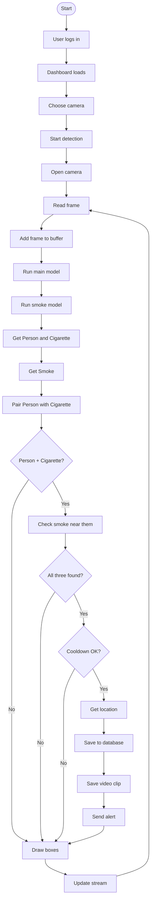

# Activity diagram – detection flow (Mermaid)

Paste the code below into [Mermaid Live Editor](https://mermaid.live) or any Mermaid-supported tool to generate the diagram.

```mermaid
flowchart TD
    Start([Start]) --> Login[User logs in]
    Login --> Dashboard[Dashboard loads]
    Dashboard --> ChooseCamera[Choose camera]
    ChooseCamera --> StartDetection[Start detection]
    StartDetection --> OpenCamera[Open camera]
    OpenCamera --> ReadFrame[Read frame]
    ReadFrame --> BufferFrame[Add frame to buffer]
    BufferFrame --> RunMainModel[Run main model]
    RunMainModel --> RunSmokeModel[Run smoke model]
    RunSmokeModel --> ParseMain[Get Person and Cigarette]
    ParseMain --> ParseSmoke[Get Smoke]
    ParseSmoke --> PairPersonCig[Pair Person with Cigarette]
    PairPersonCig --> MatchSmoke{Person + Cigarette?}
    MatchSmoke -->|No| DrawBoxes[Draw boxes]
    MatchSmoke -->|Yes| CheckSmoke[Check smoke near them]
    CheckSmoke --> AllThree{All three found?}
    AllThree -->|No| DrawBoxes
    AllThree -->|Yes| CooldownOK{Cooldown OK?}
    CooldownOK -->|No| DrawBoxes
    CooldownOK -->|Yes| GetLocation[Get location]
    GetLocation --> SaveDB[Save to database]
    SaveDB --> SaveClip[Save video clip]
    SaveClip --> SendAlert[Send alert]
    SendAlert --> DrawBoxes
    DrawBoxes --> UpdateStream[Update stream]
    UpdateStream --> ReadFrame
```
